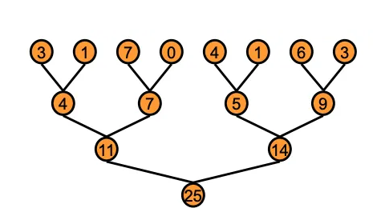
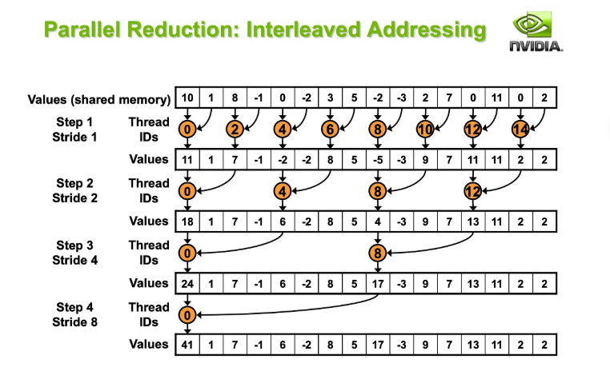

# Reduction trong CUDA 

## Đặt vấn đề bài toán 
Write a CUDA program that performs parallel reduction on an array of 32-bit floating point numbers to compute their sum. The program should take an input array and produce a single output value containing the sum of all elements.

Implementation Requirements
Use only CUDA native features (external libraries are not permitted)
The solve function signature must remain unchanged
The final result must be stored in the output variable


**Example 1:**
Input: [1.0, 2.0, 3.0, 4.0, 5.0, 6.0, 7.0, 8.0]
Output: 36.0

**Example 2:**
Input: [-2.5, 1.5, -1.0, 2.0]
Output: 0.0

## Thuật toán tổng quát 
Cách thức giải quyết bài toán thông qua sử dụng cơ chế giảm dần, thực hiện chia nhỏ đoạn array cho nhiều thread, mỗi tầng của cây, thực hiện tính tổng số 2 phần tử trước đó và thực hiện đồng bộ hóa toàn bộ tầng để thực hiện tính toán tiếp theo.  

<p align="center">
  
</p>

### Thuật toán Interleaved Addressing 

Thuật toán thực hiện chia nhỏ các memory address để mỗi thread thực hiện xử lý các phần tử ở cách xa nhau (thay vì liên tiếp). Ví dụ: 

Nếu list bao gồm 1024 phần từ và mỗi block chứa 256 threads khi đó mỗi thread sẽ thực hiện xử lý 4 phần tử => thread 0 sẽ thực hiện xử lý các phần từ 0, 256, 512, và 768. Trong mỗi lần xử lý các phần tử trên, thực hiện tính tổng các phần từ ở giữa (ví dụ ở giữa khoảng từ 0 - 256 là 128). 


```cpp
__global__ void reduce0(int *g_in_data, int *g_out_data){
    extern __shared__ int sdata[];  // stored in the shared memory

    // Each thread loading one element from global onto shared memory
    unsigned int tid = threadIdx.x;
    unsigned int i = blockIdx.x * blockDim.x + threadIdx.x;
    sdata[tid] = g_in_data[i];
    __syncthreads();

    // Reduction method -- occurs in shared memory because that's where sdata is stored
    for(unsigned int s = 1; s < blockDim.x; s *= 2){
        if (tid % (2 * s) == 0) {
            sdata[tid] += sdata[tid + s];   
        }
        __syncthreads();
    }
    if (tid == 0){
        g_out_data[blockIdx.x] = sdata[0];
    }
}
```

**Giải thích thuật toán** : 
1. Gán dữ liệu từ global memory vào shared memory (đồng bộ hóa để lưu trữ dữ liệu vào trong shared memory cho từng block)

<p align="center">
  
</p>


2. Thực hiện duyệt qua mỗi block và tính tổng giá trị theo mỗi bước nhảy s (bằng 1 / 2 của khoảng cách được định nghĩa, đồng thời không thực hiện cộng các biến nằm ngoài khoảng cách 2 lần - tức ra ngoài block)

3. Cộng lần lượt => lưu trữ dữ liệu vào trong thread đầu tiên


**Vấn đề của thuật toán**:

1. Sử dụng phép % làm việc tính toán chậm hơn 
2. Sử dụng lệnh if khiến các warps bị rẽ nhánh, không thực thi đồng thời, chứa tối ưu về mặt bộ nhớ do cần truy cập các thông tin nằm ở các warp khác nhau. 


=> Cải tiến hơn của thuật toán này => sử dụng một index thông qua phép nhân thay thế. 

```cpp 
// REDUCTION 1 – Interleaved Addressing without branch divergence and % operation
__global__ void reduce1(int *g_in_data, int *g_out_data){
    extern __shared__ int sdata[];  // stored in the shared memory

    // Each thread loading one element from global onto shared memory
    unsigned int tid = threadIdx.x;
    unsigned int i = blockIdx.x * blockDim.x + threadIdx.x;
    sdata[tid] = g_in_data[i];
    __syncthreads();

    // Reduction method -- occurs in shared memory
    for(unsigned int s = 1; s < blockDim.x; s *= 2){
        // note the stride as s *= 2 : this causes the interleaving addressing
        int index = 2 * s * tid;    // now we don't need a diverging branch from the if condition
        if (index + s < blockDim.x)
        {
            sdata[index] += sdata[index + s];   // s is used to denote the offset that will be combined
        }
        __syncthreads();
    }
    if (tid == 0){
        g_out_data[blockIdx.x] = sdata[0];
    }
}
```